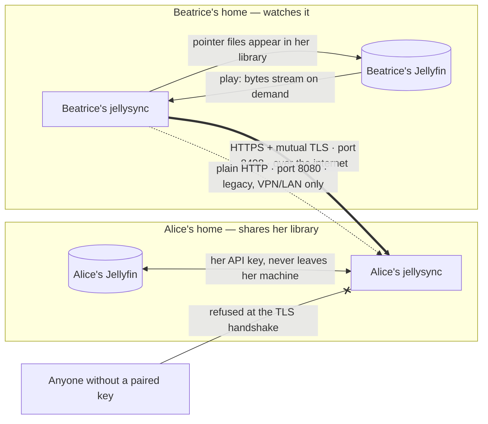
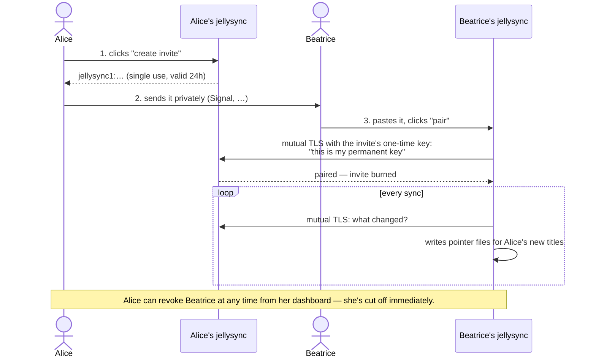
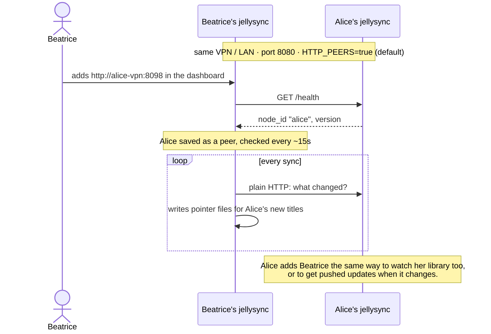
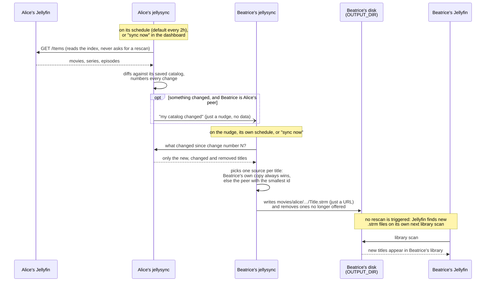
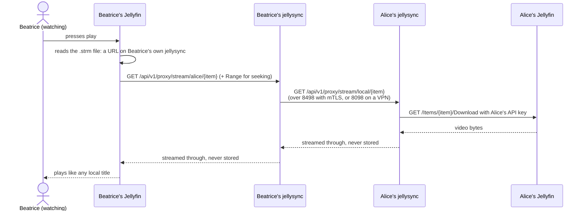

# jellysync

Share your Jellyfin library with friends' Jellyfin servers — without copying files, without giving anyone your server login, and without exposing anything but one small, locked port.

## What does it actually do?

Say you and a friend each run your own Jellyfin server. Normally, if you want to watch something that's only on their server, you're stuck asking them to copy the file over or share their whole Jellyfin login.

jellysync is a small helper that runs quietly next to your Jellyfin. It talks to your friend's helper, and the two of them swap lists of "here's what I have." For anything you don't already have yourself, jellysync drops a tiny pointer file into your Jellyfin library — so the movie or show just *shows up*, like it was always there. When you hit play, jellysync fetches the video from your friend's server in the background and hands it straight to your Jellyfin. You never notice the difference.

If you already have your own copy of something, your copy always wins — jellysync never overrides or duplicates what's already on your server.

**What jellysync is not:** it doesn't touch your Jellyfin login or API key on anyone else's machine, it doesn't open your whole server to the internet, and it doesn't require you to manually copy a single file.

## How it fits together



- Your jellysync only ever talks to *your* Jellyfin using *your* API key. That key never leaves your machine.
- Your jellysync only talks to jellysync nodes you've explicitly paired with — never to their Jellyfin directly.
- Nodes pair with a one-time **invite** string. After that, every connection between them is encrypted, and both sides prove who they are with a key that never leaves their machine. Anyone else knocking on the port is turned away during the TLS handshake, before jellysync reads a single byte of their request.
- Everything runs in Docker, one container per Jellyfin instance.

### Two ports, two jobs

| Port (in the container) | Published as | Protocol | Meant for | Switch |
|---|---|---|---|---|
| `8080` | `8098` | plain HTTP | Your dashboard, and peers added the old way by URL. **LAN or VPN only — never expose it to the internet.** Unchanged from earlier versions. | `HTTP_PEERS` — **on** by default. Turning it off removes only the peer part; the dashboard stays. |
| `8443` | `8498` | HTTPS with mutual TLS | Peers paired by invite. **Safe to expose to the internet**: only paired keys get in, and they can only read your catalog and stream from it. | `MTLS_PEERS` — **off** by default. |

Out of the box a node behaves exactly like earlier versions: legacy peers on, invites off, nothing listening on the HTTPS port. Turn on `MTLS_PEERS` to pair by invite; once all your peers are paired, you can turn off `HTTP_PEERS`.

### Sharing by invite (HTTPS + mutual TLS)



That's all: no certificates to buy, no keys to copy, no config files to edit on Beatrice's side. Sharing is one-way — Beatrice reads Alice's library, Alice never connects to Beatrice. To share both ways, Beatrice sends Alice an invite too.

### Sharing over a VPN (plain HTTP, the legacy way)

If you and your friend are already on the same private network (Tailscale, WireGuard, ZeroTier…), there's nothing to pair: each side just adds the other's address. Simpler, but there's no authentication — anyone who can reach the address is trusted, so the private network *is* the security.



## How syncing and playback work

The same flow runs over either port; only the connection between the two jellysync nodes differs.

### Library sync



Each side only ever sends what changed since the last sync, from a saved snapshot — never a live listing of Alice's whole Jellyfin — so a routine sync with nothing new is one tiny request.

#### Hiding titles

Every movie and series in the dashboard has a **hide** button that leaves it out of syncing, in both directions:

- **Your own title**: your peers no longer see it. It disappears from their libraries just as if you had deleted it, but it stays in yours.
- **A peer's title**: no `.strm` file is written for it, and an existing one is removed.

Hiding a series hides all of its episodes, including ones added later. A hide takes effect at the next sync (the dashboard shows it as pending until then), and **unhide** reverses it the same way. If a hidden title goes away on its own (you delete the file, or the peer stops offering it), the hide is forgotten, so the title shows up as normal if it ever comes back.

### Playback



Alice's API key is only ever used between Alice's own jellysync and her own Jellyfin; Beatrice's side never sees it, and never talks to Alice's Jellyfin.

## Before you start

- **Docker and Docker Compose** installed.
- **A Jellyfin server** — either one you already run, or use the one included in the compose file to set up a fresh one.
- **To share your library: one forwarded port.** Whoever *shares* a library by invite must be reachable on TCP port `8498` (forward it on your router, or use a VPN like Tailscale or WireGuard). Someone who only *watches* a friend's library needs no open port at all.

## Quick start

### 1. Get the project

```sh
git clone <this repo> jellysync && cd jellysync
```

Open `docker-compose.yml` and give your node a name — anything unique works, e.g. your name:

```yaml
- NODE_ID=stefano
```

### 2. Start it up

```sh
docker compose up -d
```

This starts both Jellyfin and jellysync. (Already running your own Jellyfin elsewhere? Remove the `jellyfin` block from `docker-compose.yml` and point `JELLYFIN_URL` at your existing server instead.)

jellysync will exit immediately with `JELLYFIN_API_KEY is required` — expected at this point, since you haven't done step 3 yet.

### 3. Get a Jellyfin API key

1. Open your Jellyfin, sign in as an admin.
2. Go to the **Dashboard** (gear icon, top right) → **Advanced** → **API Keys**.
3. Click **+**, name it "jellysync", confirm.
4. Copy the key it gives you.

Paste it into `docker-compose.yml`:

```yaml
- JELLYFIN_API_KEY=paste-it-here
```

Then restart jellysync so it picks up the change:

```sh
docker compose up -d
```

### 4. Open the dashboard

Visit `http://<this-machine>:8098` in a browser. You'll see your node's status, an empty peers list, and an empty catalog — that's expected, you haven't added anyone yet.

### 5. Pair with a friend

Sharing is one-way: whoever shares a library creates an invite, whoever wants to watch it redeems it. Say Alice shares, Beatrice watches.

**Alice** (shares):

1. In `docker-compose.yml`, uncomment `MTLS_PEERS=true` and `PUBLIC_URL`, setting the latter to the address Beatrice can reach Alice's port `8498` at, e.g. `https://alice.duckdns.org:8498`. Run `docker compose up -d`.
2. Forward TCP port `8498` on her router to the machine running jellysync.
3. In the dashboard's settings, under **Who can access my library**, click **create invite** and send the string to Beatrice **privately** (e.g. Signal). Anyone holding it can pair once, within 24 hours.

**Beatrice** (watches): she sets `MTLS_PEERS=true` too (no `PUBLIC_URL`, no open port needed), then in her dashboard's settings, under **Peers**, pastes the invite and clicks **pair**. Alice now shows up as a peer marked `mTLS`, and her library shows up in Beatrice's Jellyfin after the next sync.

To share in both directions, do it again the other way round. Alice can see who has access, and **revoke** anyone, under **Who can access my library** — they're cut off immediately.

Nodes still on an older jellysync, or reachable only over a VPN, can also be added the old way: paste their dashboard address (e.g. `http://their-vpn-address:8098`) in the legacy **add by URL** box. That connection is unauthenticated plain HTTP, so only use it over a private network.

## Upgrading from an earlier version

Version 0.1.0 adds sharing by invite over HTTPS with mutual TLS. Upgrading to it from 0.0.x breaks nothing, and nothing has to change:

- **Your existing peers keep working exactly as before**, on port `8080`, whether they've upgraded or not. Old and new versions sync and stream with each other normally.
- **Your existing compose file keeps working as is.** Every new setting is optional and off by default: without `MTLS_PEERS=true`, nothing new listens and nothing about your node changes. To start sharing by invite, set `MTLS_PEERS=true`, add the `"8498:8443"` port mapping and (to create invites) `PUBLIC_URL` — all shown in the included `docker-compose.yml`.
- **Moving an existing peer to the secure port** is just a pairing: redeem an invite from that same node. jellysync recognizes it and upgrades the peer in place — same entry, same files in your Jellyfin library, no catalog re-download. You can then drop your VPN for that peer, and once every peer is paired, set `HTTP_PEERS=false`.
- **Switching a transport off never loses anything.** Peers using it show as `DISABLED`: they aren't contacted and their titles leave your library, but jellysync keeps their entry and catalog, so switching back on picks up where it left off.
- Your database is upgraded automatically on first start (new tables and one new column; existing data is untouched).

## Configuration reference

Everything is configured as environment variables on the `jellysync` service in `docker-compose.yml` — there's no separate config file. After changing any of these, run `docker compose up -d` to apply them.

| Variable | What it means |
|---|---|
| `NODE_ID` | A name for this node. Must be unique among your peers. |
| `JELLYFIN_URL` | Address of *your* Jellyfin, as seen from inside the jellysync container. |
| `JELLYFIN_API_KEY` | The API key from step 3 above. Never shared with peers. |
| `DB_PATH` | Where jellysync stores its database inside the container. Defaults to `./data/jellysync.db`; the included compose file sets it to `/data/jellysync.db`, which lands in the mounted `./jellysync/data` folder. |
| `OUTPUT_DIR` | Folder jellysync writes pointer files into. Must be a folder your Jellyfin also has mounted, as a library. |
| `BASE_URL` | The address *your own* Jellyfin uses to reach jellysync. If you used the included `docker-compose.yml` as-is, leave this at `http://jellysync:8080`. |
| `HTTP_PEERS` | Optional, defaults to `true`. Legacy peers over plain HTTP: the peer endpoints on port `8080` and peers added by URL. Set to `false` once all your peers are paired by invite; your dashboard and your own Jellyfin's playback keep working on `8080` either way. |
| `MTLS_PEERS` | Optional, defaults to `false`. Peers paired by invite over HTTPS with mutual TLS: opens the HTTPS port (`8443` in the container, published as `8498`) and enables creating and redeeming invites. |
| `PUBLIC_URL` | Optional — with `MTLS_PEERS=true`, the `https://host:port` address others reach your HTTPS port at, e.g. `https://alice.duckdns.org:8498`. Written into the invites you create. Without it you can still redeem other people's invites, just not create your own. |
| `PEERS` | Optional — a starting list of legacy (plain HTTP, private network only) peers as `id=url,id=url`, in case you'd rather edit this than use the dashboard. The dashboard's Peers list is the same data either way, and additions there persist across restarts even if they're not set here. Peers on the secure port are paired by invite instead. |
| `STREAM_BUFFER_KB` | Optional, defaults to `256`. Size (in KiB) of the buffer used to relay streamed bytes between peers. Rarely needs changing — a bigger buffer trades a little memory per active stream for fewer syscalls, which can help CPU usage on constrained hardware serving high-bitrate streams. |
| `JELLYFIN_TIMEOUT_SEC` | Optional, defaults to `240`. How long jellysync waits on any single request to *your* Jellyfin, including the recursive catalog listing it issues every sync cycle. Raise this if syncs still fail with `context deadline exceeded` — a very large library (or constrained hardware) can take longer than the default to answer that listing. |
| `PEER_FETCH_TIMEOUT_SEC` | Optional, defaults to `60`. How long jellysync waits for each request to a peer during sync. Peers exchange catalogs incrementally — only what changed since the last sync, in pages of up to 2000 items — and answer from their own saved snapshot rather than asking their Jellyfin, so each request is small and fast. Only peers still on an older jellysync build answer with their whole catalog in one go (after a live Jellyfin listing); raise this if sync logs show `context deadline exceeded` for such a peer. |
| `LOG_LEVEL` | Optional, defaults to `DEBUG`. How much jellysync logs: `DEBUG`, `INFO`, `WARN` or `ERROR`. `DEBUG` shows every step of a sync (each peer's pages, election details, every `.strm` written or removed, each stream start/finish); `INFO` keeps one summary line per step, plus peer state changes, notifications and configuration changes; `WARN` only shows problems. Read them with `docker compose logs -f jellysync`. |

About the two ports (see [Two ports, two jobs](#two-ports-two-jobs)):

- `8080` is your dashboard: **anyone who can reach it can control your node**. Bind it to your LAN address (e.g. `"192.168.1.10:8098:8080"`) to keep it off other networks.
- `8498` (container port `8443`, with `MTLS_PEERS=true`) is the one to forward on your router. If it can't start (say, the port is already taken), jellysync logs an error and keeps running on `8080`, so legacy peers are never affected. If you put a reverse proxy in front of it, it must pass TLS through untouched (TCP/SNI passthrough), not terminate it — the client key has to reach jellysync.
- To use different ports on your host, change the host side of the `ports` mappings, not the container side.

Your node's private key lives in its database (`DB_PATH`). Back it up with the rest of the data folder: lose it and every friend has to pair with you again; leak it and someone could pose as your node until your friends revoke it.

## Security in short

- **Port 8498** (off unless `MTLS_PEERS=true`) accepts only keys you've paired with. A paired friend can read your catalog, stream your files, and ask you to refresh your catalog (at most once every 10 minutes). Nothing else — not your dashboard, not your settings, and not your own peers' libraries: nobody can use your node as a relay.
- **Invites** are single-use, expire after 24 hours, and can be cancelled from the dashboard. They carry a one-time key, so send them privately. An invite also pins the sharer's key, so it can't be used to lure you to an impostor.
- **Port 8080** is unauthenticated, as it always was: keep it on your LAN or VPN. With `HTTP_PEERS=false` it no longer serves your catalog to anyone.

## Good to know (limitations)

- **Legacy peers added by URL are unauthenticated.** Only peers paired by invite are authenticated; the old add-by-URL path on port `8080` trusts anything that can reach it, so keep that port on a private network.
- **Pairing is per pair of nodes** — there's no relaying through a peer's peers. If you and two friends want to share with each other, each of you invites the others directly.
- **A friend who only watches your library hears about your changes at their next sync**, not instantly: you can't notify a node you never connect to.
- **If a peer's copy stops mid-stream, playback just fails** rather than automatically switching to another copy (only relevant if the same movie exists on more than one peer).

## Troubleshooting

- **Nothing shows up after adding a peer.** Run a sync from the dashboard, or wait for the next scheduled one. If it's still empty, check the peer's status in the dashboard — it should say `ONLINE`. If it says `OFFLINE`, their port isn't reachable from your machine: check their `PUBLIC_URL`, their port forwarding, and (for a legacy peer) your VPN connection to them.
- **"invite was rejected".** It was already used, cancelled, or is older than 24 hours. Ask for a new one.
- **"not the one that created this invite".** The address in the invite leads to a different machine than the one that created it — usually a wrong `PUBLIC_URL` or port forward on the sharer's side. jellysync refuses to connect.
- **"create invite" or "pair" is greyed out.** Set `MTLS_PEERS=true` (and, to create invites, `PUBLIC_URL`) and restart jellysync.
- **A peer shows `DISABLED`.** Its transport is switched off on your node: `HTTP_PEERS=false` for a peer added by URL, `MTLS_PEERS` not set for one paired by invite.
- **jellysync won't start.** Check `docker compose logs jellysync` — it fails fast with a clear message if it can't reach your Jellyfin or if a required environment variable is missing.
